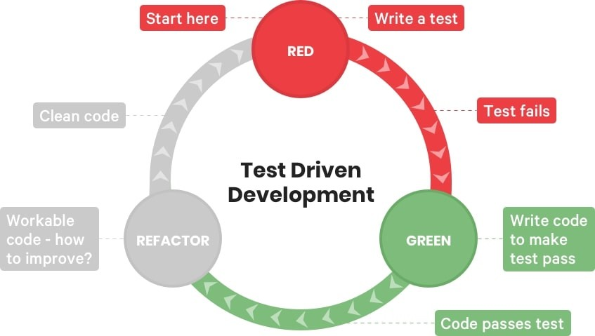

## Marco teorico

### Vigilancia Epidemiológica y Entomológica del Dengue

Las enfermedades transmitidas por vectores (ETV), son padecimientos en los que un artrópodo (mosquitos, chinches, garrapatas, etc.) actúa como agente infeccioso. A este tipo de artrópodos se le denomina “vector” (@gobmx2023). Este vector actúa como hospedero y/o transmisor de la enfermedad, durante su ciclo de vida tienen diferentes hospederos periodo en el cual adquiere la enfermedad y puede transmitirla a hospederos vertebrados como los humanos (@gobmx2023). Algunos ejemplos de este tipo de enfermedades son: paludismo, dengue, leishmaniasis, oncocercosis, tripanosomiasis, rickettsiosis, fiebre del oeste del Nilo, fiebre chikungunya, erliquiosis, anaplasmosis y otras arbovirosis (@Braks2003; @gobmx2023). Las ETV representan un problema de salud pública en México. Se estima que donde se localiza la mayor parte de centros agrícolas, ganaderos, industriales, pesqueros, petroleros y turísticos, es decir; en cerca de 60 % del territorio nacional, se tienen condiciones ambientales que favorecen su transmisión ( @Braks2003; @gobmx2023) . Entre ellas, el dengue representa una grave amenaza, con brotes recurrentes en diversas regiones del país. Para prevenir y controlar eficazmente las enfermedades antes mencionadas, en México existen los programas de vigilancia entomológica y control integral de enfermedades transmitidas por vectores a nivel federal y estatal (@Braks2003; @gobmx2023).

#### Vigilancia Epidemiológica:

La vigilancia epidemiológica del dengue comprende, recopilar, analizar y difundir sistemáticamente información sobre la enfermedad. Sus objetivos incluyen la detección temprana de brotes, la medición de la carga de la enfermedad, el seguimiento de las tendencias, la evaluación del impacto social y económico. Asimismo ayuda en la asignación de recursos, planificación de acciones preventivas y de contención. Por ello, la vigilancia epidemiológica es esencial para el control y la gestión eficaz contra la enfermedad ( @Bowman2014; @Weetman2018; @SouthEastAsia2011; @Organization2016; @gobmx2023).

#### Índices Estegomía

Para evaluar la presencia y densidad de los mosquitos Aedes, los programas estatales de prevención y control del dengue utilizan los llamados índices de estegomía. Estos índices cuantifican el riesgo entomológico con respecto a criaderos potenciales y criaderos habitados por larvas o pupas del mosquito Aedes a través del muestreo en campo. El muestreo debe ser uniforme en el área de estudio y la unidad de muestreo básica es la casa o localidad ( @Garjito2020; @gobmx2023). Al muestrear, el objetivo es observar sistemáticamente contenedores de almacenamiento de agua. Los contenedores se examinan para detectar la presencia de larvas y pupas de mosquitos (@Garjito2020).

La Organización Mundial de la Salud (OMS ) ( @SouthEastAsia2011; @Organization2016; @Tedjou2020) recomienda el uso de los índices estegomía para evaluar la presencia y la densidad de criaderos de mosquitos en las comunidades (). Los índices utilizados son el índice de casa positiva (HI), el índice de contenedor positivo y el índice de Breteau. En el estado de Sonora el "Programa de Acción Específico de Enfermedades Transmitidas por Vector" (PAE-ETV) usa estos índices para ayudar a determinar las acciones que mitigan el riesgo entomológico. A continuación, presento los índices de estegomía empleados por el PAE-ETV (@Vigilanciaentomologica2019; @Tedjou2020).

##### índice de casa positiva (HI) {.unnumbered}

El índice de casa positiva (HI) es definido como la proporción de casas infestadas con larvas o pupas. La OMS ( @SouthEastAsia2011; @Organization2016; @Tedjou2020) recomienda usar la siguiente expresión para su cálculo (@Quintero2015; @Garjito2020; @Tedjou2020).

$$         
  HI = \frac{
   \text{Número de casas infestadas}
  }{
    \text{Número de casas inspeccionadas}
  } \times 100
$$ {#eq-hi-index}

En Sonora el PAE-ETV utiliza este índice HI para monitorear la infestación de casas. Además, permite evaluar la presencia, y estimar la distribución del mosquito (@Quintero2015; @Garjito2020; @Tedjou2020). Este índice considera a las casas como unidad de observación, no toma en cuenta la cantidad de contenedores positivos ni la productividad de esos contenedores (@Quintero2015; @Garjito2020).

El índice de casa positiva se ha utilizado más ampliamente para monitorear los niveles de infestación, pero no toma en cuenta la cantidad de contenedores positivos ni la productividad de esos contenedores (@Garjito2020; @Tedjou2020).

Dentro de un área dada, el cálculo de este índice asume la misma probabilidad de transmisión del virus. De esta manera, si calculamos el índice HI en una muestra de un sector se puede inferir para todo el sector ( ; @Garjito2020; @Tedjou2020). La OMS considera en riesgo entomológico cuando al menos uno de los índices de estegomía es igual o mayor a 5 ( @SouthEastAsia2011; @Organization2016; @Garjito2020; @Tedjou2020)

##### índice de contenedor positivo (CI) {.unnumbered}

El índice de contenedor positivo (CI) se define como la proporción de contenedores con presencia de larvas o pupas de mosquito en relación con todos los contenedores que tienen agua ( @SouthEastAsia2011; @Organization2016; @Garjito2020; @Tedjou2020). A continuación, se muestra la siguiente expresión para su cálculo ( @SouthEastAsia2011; @Organization2016; @Garjito2020; @Tedjou2020)

$$         
  CI = \frac{
   \text{Número de contenedores infestados}
  }{
    \text{Número de contenedores inspeccionados}
  } \times 100
$$ {#eq-ci-index}

El índice CI es útil para conocer la proporción de contenedores con agua que tienen larvas o pupas de mosquito, y permite estimar el riesgo en el área estudiada. Este índice ayuda a evaluar la densidad de criaderos en la zona (@Quintero2015; @Garjito2020; @Tedjou2020). Por ello, proporciona información para identificar las áreas con mayor riesgo de infestación. Por lo tanto, en caso de que el índice CI sea bajo y el HI sea alto, se infiere que el riesgo es mínimo por cada casa muestreada, pero está muy disperso; Lo cual sugiere el realizar acciones de control y prevención en toda el área de estudio (sector, colonia o localidad) ( @SouthEastAsia2011; @Organization2016; @Garjito2020; @Tedjou2020).

El clasificar el tipo de contenedor permite elegir la estrategia específica para las condiciones particulares del área de estudio, como puede ser aplicar control físico para mantener bajo control o eliminar criaderos potenciales, dependiendo de la cantidad y el tamaño se puede solo tirar a la basura u organizar campañas de eliminación o descacharre de ser necesario. Otra estrategia sería el uso de químicos larvicidas como apoyo al control físico ( @SouthEastAsia2011; @Organization2016; @Garjito2020; @Tedjou2020).

En caso de que índice CI es alto y el HI sea bajo, esto indica que el riesgo está concentrado en pocas casas infestadas, por lo que se pueden enfocar las acciones en esa zona específica. Los índices son complementarios y se necesitan ambos para identificar correctamente el riesgo entomológico y tomar medidas efectivas para combatirlo ( @TunLin1996; @SouthEastAsia2011; @Organization2016; @Garjito2020; @Tedjou2020).

##### índice de Breteau (BI) {.unnumbered}

El índice Breteau (BI) describe número de recipientes positivos por cada 100 casas inspeccionadas ( @TunLin1996; @Bowman2014; @Quintero2015; @Garjito2020; @Tedjou2020).

$$         
  BI = \frac{
   \text{Número de contenedores infestados}
  }{
    \text{Número de casas inspeccionadas}
  } \times 100
$$ {#eq-bi-index}

El BI proporciona una relación directa entre la cantidad de recipientes positivos y el número de casas inspeccionadas. Cunado los contenedores positivos tienden a ser uno por casa positiva el BI valdrá igual al HI (). En el caso que el BI salga alto pese a que los otros dos índices sean bajos, esto indica una alta concentración de recipientes por casa aunque la proporción de casas positivas sea baja y la proporción de recipientes positivos también sea baja, en este caso el riesgo es que mas recipientes ( @SouthEastAsia2011; @Organization2016; @Garjito2020; @Tedjou2020). El BI evalúa la distribución espacial de los criaderos y sirve para orientar las acciones de control y prevención. Sin embargo, no refleja la productividad de los contenedores, lo que limita su capacidad para proporcionar una evaluación completa del riesgo de transmisión del virus. Estos datos son particularmente relevantes para centrar esfuerzos para la gestión o eliminación de los hábitats más comunes y para la orientación de mensajes educativos en apoyo de iniciativas comunitarias ( @Bowman2014; @SouthEastAsia2011; @Organization2016; @Garjito2020; @Tedjou2020). La vigilancia epidemiológica y entomológica ayudan a dirigir las acciones necesarias para la prevención y control de ETVs como el dengue. Mediante la recopilación sistemática de datos sobre la enfermedad y los vectores, se pueden tomar decisiones informadas para mitigar su impacto y proteger a la población (@TunLin1996; @SouthEastAsia2011; @Organization2016; @Garjito2020; @Tedjou2020). los índices de estegomía son indispensables para la vigilancia y el control del dengue. Proporcionando información valiosa para evaluar el riesgo de transmisión, y permiten la tomar decisiones estratégicas para priorizar acciones y monitorear la efectividad de las intervenciones, para prevenir la transmisión del dengue y proteger la salud de la población ( @SouthEastAsia2011; @Organization2016; @Garjito2020; @Tedjou2020).

### Programa de Acción Específico de Enfermedades Transmitidas por Vector

El Programa de Acción Específico de Enfermedades Transmitidas por Vector"(PAE- ETV), realiza diversas actividades para la prevención y control de ETV. Estas actividades se pueden dividir en dos grupos: las de vigilancia entomológicas y las de prevención y control (). El objetivo de todas estas acciones es prevenir y controlar brotes de enfermedades transmitidas por vectores. Las ETV son aquellas causadas por un agente vivo (como los insectos) que ingieren microorganismos de la sangre que consumen de otros seres vivos y después los transmiten mediante sus picaduras (@Vigilanciaentomologica2019).

| Actividades | Abreviatura | Descripción |
|-------------------|-------------------|-----------------------------------|
| Vigilancia entomológica con ovitrampas | OV | Las ovitrampas son contenedores con atributos ideales para que los mosquitos utilicen como criadero De esta forma, el personal del programa de vectores se encarga de revisar, colectar y contabilizar los huevecillos de los mosquitos y realizar una comparación de la densidad. |
| Estudios entomológicos en fase larval y pupal | EE | Búsqueda de criaderos con larvas o pupas de mosquitos dentro de las casas de una zona a trabajar, se realiza una búsqueda previa a las acciones de control de ETV y una búsqueda posterior cuando el área ya ha sido intervenida por las acciones de prevención y control. |
| Estudios Entomovirológicos | EEV | Colecta de mosquitos adultos dentro de viviendas para identificar las especies transmisoras de ETV, asimismo para el análisis por PCR de los mosquitos buscando encontrar ETV circulando en las áreas antes de que se reporten casos en personas. |

: Actividades de prevencion y control {#tbl-tabla-2.1} {.striped .hover}

| Actividades | Abrebiatura | Descripcion |
|-------------------|-------------------|----------------------------------|
| Control Larvario | CL | Búsqueda intencionada de criaderos potenciales de mosquitos de un área determinada para la aplicación de medidas de prevención, en todas las casas que permitan la entrada. |
| Rociado a caso probable | RaC | Aplicación intradomiciliar de insecticida con efecto residual en casas dentro de un cerco de 5 a 9 casas en respuesta a un caso probable o confirmado a Dengue, Zika o Chicungunya. |
| Rociado intradomiciliario | RI | Aplicación intradomiciliar de insecticida con efecto residual en casas de un área que se considere de riesgo entomológico y susceptible a contagios de ETV. |
| Nebulización espacial | N | Aplicación de rociado espacial de insecticidas sin efecto residual en un área con alto riesgo entomológico o en respuesta a casos probables o confirmados. |

: Actividades de prevencion y control {#tbl-tabla-2.2} {.striped .hover}

#### Plataforma de Vigilancia Entomológica y Control Integral del Vector

El Programa de Acción Específico de Enfermedades Transmitidas por Vector (PAE-ETV) registra diariamente en una plataforma todas las actividades mencionadas en las tablas Tabla 1.1 y Tabla 1.2 (@Vigilanciaentomologica2019). Esto permite al programa estatal descargar y analizar los datos. Para la actividad de EE, el programa calcula los resultados por área trabajada y requiere el reporte semanal con base en la ubicación, como se observa en la Tabla 2.2 y el sistema integral de vigilancia de vectores (@Vigilanciaentomologica2019). La actividad de EE implica el muestreo de formas inmaduras de los mosquitos (las larvas y las pupas) en lugar de capturar huevos o mosqui- tos adultos. Se realizan búsquedas sistemáticas para detectar recipientes que contengan agua e inspeccionar la presencia de larvas, pupas y larvas y pupas de mosquitos (). Esta actividad evalúa una muestra antes (encuesta) y después (verificación) de las actividades de control integral para determinar el riesgo entomológico en un área trabajada (sectores o localidades) y si es necesario reforzar las acciones de control, ver Tabla 1.1 y Tabla 1.2. (@Vigilanciaentomologica2019; @Garjito2020).

#### Datos Geograficos

El PAE-ETV proporcionó shapefiles del estado de Sonora y como esta todo dividido en sectores. Estos son los sectores en los que se basa la distribución de todas las actividades del PAE-ETV y se usan para poder geopreferencia las áreas intervenidas, determinar el riesgo entomológico y planear las actividades de control y prevención que se requieran (@Vigilanciaentomologica2019). Los shapefiles pueden usarse para crear mapas con los indines de estegomía específicos en tiempo y lugar según se necesite (@Vigilanciaentomologica2019).

### Desarrollo de un paquete de R con desarrollo basado en pruebas (TDD)

Para determinar el riesgo entomológico delimitado por área geográfica (desde un sector específico o hasta una localidad o municipio) ().Es necesario obtener la información de la vigilancia entomología de forma periódica, y comprender la estructurada la base de datos de EE (). Por lo cual implementaremos herramientas de ciencias de datos para aplicar una metodología en la gestión y análisis de esta información. Esto implicaría calcular los índices de estegomia para un lugar y en un tiempo determinado para la toma de decisiones (). Este trabajo presenta el desarrollo de un paquete R para el análisis de los datos de vigilancia entomológica del dengue, siguiendo una metodología de desarrollo basado en pruebas (TDD) (). El paquete combina la potencia de Tidyverse para la manipulación de datos, Devtools para la gestión de Testthat para la escritura de pruebas unitarias ().

El desarrollo de software en R ha evolucionado hacia metodologías más sofistica- das y automatizadas. El uso combinado de frameworks como Tidyverse, Devtools y Testthat permite crear un trabajo con desarrollo basado en pruebas (TDD) para proyectos de R (ver Figura 1.1). Tidyverse es una colección de paquetes R enfocados en la manipulación de datos, análisis estadístico y visualización. Su filosofía funcional facilita la escritura de código modular y limpio (). Devtools es un paquete R indispensable para la gestión de proyectos, creación de paquetes y publicación en CRAN. Automatiza tareas comunes como la ejecución de pruebas y generación de documentación. Testthat es un paquete R crucial para implementar TDD (). Permite escribir pruebas unitarias que garantizan el funcionamiento correcto de cada función o módulo del código ().

Figura 1.1: Diagrama del Paradigma TDD

El desarrollo basado en pruebas (TDD) es una metodología de desarrollo de software en la que se escriben pruebas antes de escribir el código. Esto ayuda a garantizar que el código esté bien escrito y cumpla con los requisitos (). Escribir pruebas: Se definen pruebas unitarias para cada función utilizando Testthat. Desarrollar código: Se implementa el código que satisface las pruebas escritas. Ejecutar pruebas: Se ejecutan las pruebas para verificar el funciona- miento del código. Refactorizar: Se mejora la legibilidad y mantenibilidad del código sin alterar su funcionalidad. Repetir: Se repiten los pasos anteriores hasta completar el desarrollo (). Combinar Tidyverse, Devtools y Testthat en un flujo de trabajo TDD es una práctica recomendada para el desarrollo de software en R. Esta metodología permite tener menos errores, crear código más robusto, legible y eficiente, facilitando la colaboración y el mantenimiento a largo plazo de los proyectos ().

El paquete de R del presente trabajo constituye una valiosa herramienta para la vigilancia entomológica del dengue (). Su uso puede contribuir a mejorar la toma de decisiones en materia de prevención y control de la enfermedad, fortaleciendo las estrategias de salud pública en México ().
